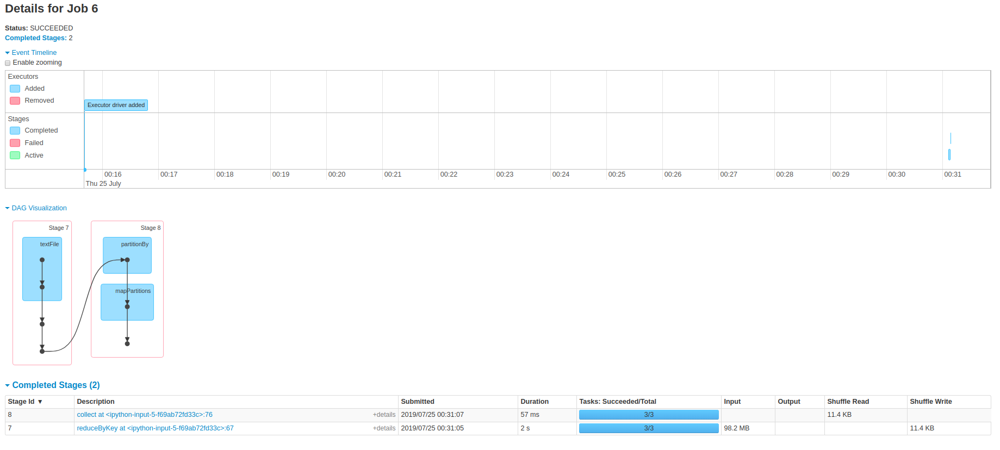

Every two months we are given a text file from our accounting department
detailing all the loans given out on our networks.

This needs to be a validated against our internal systems by the tuple
of (Network, Product, Month).


### Task

Given the below CSV (also `./input.csv`) from our accounting department
calculate the aggregate loans by the tuple of (Network, Product, Month)
with amounts and counts.

The output should be saved into a CSV file named **Output.csv**.


|MSISDN     |Network    |Date         |Product         |Amount |
|-----------|-----------|-------------|----------------|-------|
|27729554427324|'Network 1'|'12-Mar-2016'|'Loan Product 1'|1000.00|
|27722342551343|'Network 2'|'16-Mar-2016'|'Loan Product 1'|1122.00|
|27725544272422|'Network 3'|'17-Mar-2016'|'Loan Product 2'|2084.00|
|27725326345543|'Network 1'|'18-Mar-2016'|'Loan Product 2'|3098.00|
|27729234533453|'Network 2'|'01-Apr-2016'|'Loan Product 1'|5671.00|
|27723453455453|'Network 3'|'12-Apr-2016'|'Loan Product 3'|1928.00|
|27725678534423|'Network 2'|'15-Apr-2016'|'Loan Product 3'|1747.00|
|27729554427286|'Network 1'|'16-Apr-2016'|'Loan Product 2'|1801.00|


## Solution

Given the fact that this problem required a solution that was 
scalable across nodes while the same time performing optimally on a single node,
I leveraged on map-reduce processing/transformation techniques.
More specifically spark RDD map and reduce api.

### Why map-reduce paradigm?
The reason why i chose MapReduce algorithm was mainly because of its flexibility and easiness 
in  scaling processing tasks across multiple computing nodes (distributed computing). However,
while, decomposing a transformation task into mappers and reducers have empirically and can sometimes 
be nontrivial; it is important to point out that once an algorithm for MapReduce is 
implemented, scaling the routine to run over 100s, 1000s, or even tens of thousands of nodes in a cluster
is merely a configuration change. 

### Language
Python was used to implement this solution, mainly due to my familiarity using this language. 

### Packages/Plugins

I leveraged on spark RDD map and reduce api in order to meet the objective of this task. 

* It is important to note that none of the Aggregating functionalities provided natively by spark were used in this solution. 
* Additionally, none of the libraries and packages specified in the implementation notes were used in coming up with this solution. 
* Only spark RDD map and reducers were used to come up with a custom sum and count functionalities. 

Below is a snapshot of the implementation 

```python
def rddMapReducer(self, rdd):
        """ This is a custom map-reduce function

        Takes in an RDD and performs necessary transformations
        by calling 2 main functions: 1. mapByStratumKey
        and 2. reduceByStratumKey.

        Args:
          rdd: RDD of an imported dataset

        Returns:
          rdd: transformed RDD
        """
        return rdd \
            .zipWithIndex() \
            .filter(lambda x: x[1] > 1) \
            .map(lambda row: self.mapByStratumKey(row)) \
            .reduceByKey(lambda x, y: self.reduceByStratumKey(x, y)) \
            .map(lambda col: self.mergeColumnMap(col))
```
 
 
 Here mapByStratumKey and reduceByStratumKey are custom implementation of map reduce using spark RDD API
 please feel free to scan through the file main.py
 
### Unit Test

Due to the objective and scope of this task I did not perform any unit test. 
I mainly focused on scalability and performance testing as outlined in prototype.ipynb


### Assumptions 

The following assumptions were made during the  implementation of this solution:

1. Complete case analysis i.e No missing data - I assumed the provided data did not have any null/NA 
2. I did not handle different data formats: I assumed the provided format  like date were consistent with 
current and future data generation mechanism
3. I did not handle for different file formats like parquet. I assumed that all and future datasources
are and will be only of  type csv!

### Coding Patterns and Style Guidelines

I used PEP 8 -- Style Guidelines in writing classes/functions and project folder structure


### Performance and Scalability assesments
 I created a function to randomly generate 100s, 1000s, and millions of records based on the 
 distribution of the provided dataset. Using this dataset I was able to asses performance as well as
 scalability by altering number of workers/drivers in the spark config. For more details please see prototype.ipynb
 

## Results
 
 
 
The above DAG and summary illustrates the results of processing 100 million records.


## Output

The required output csv file can be found in the base directory. Additionally, performance
assessemnts have been done and illustrated in prototype.ipynb. 

In brief, for a 100 million record:

```
CPU times: user 19.7 ms, sys: 13 ms, total: 32.8 ms
Wall time: 3.05 s
```

While for 100 records:

```
CPU times: user 30.8 ms, sys: 380 µs, total: 31.2 ms
Wall time: 228 ms

```


##  How to reproduce

It is easy to reproduce the above results as shown below
```python
from pyspark import SparkContext
import main
# intialize prerequisites
sparkContext = SparkContext.getOrCreate()
loan = LoanAnalytics()
# CSV File locations
inputCsv = "./data/input.csv"
bigData = "./data/100000000.csv"
# fetch csv as RDD
csv = sparkContext.textFile(inputCsv)
#  transform RDD using map reduce
rdd = loan.rddMapReducer(csv)
# print RDD details
loan.printRddDiagnostic(sparkContext, rdd)
# view output
rdd.collect()

# save RDD as
#loan.rddToCsv(rdd, sparkContext, './Output.csv')

```

## Conclusion

In conclusion, in order to meet the objective of this assessment, map-reduce and spark RDD turned out
to be a very flexible, fast and straight forward solution to this problem. Not only does it provide the ability
to write custom mapReduce functions but also provides ability to avoid invoking aggregation
functions such as groupBy, count and summation. I tried other solutions like using for-loops but it was
not scalable enough and performed really poorly when processing even 1000 records.


